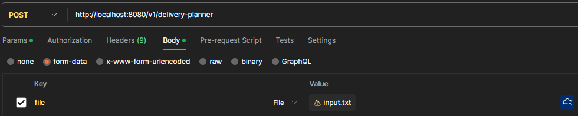

# Drone Delivery Planner

## The problem
A squad of drones is tasked with delivering packages for a major online reseller in a world
where time and distance do not matter. Each drone can carry a specific weight and can make
multiple deliveries before returning to home base to pick up additional loads; however, the goal
is to make the fewest number of trips as each time the drone returns to home base, it is
extremely costly to refuel and reload the drone.  
The purpose of the written software is to accept input which will include the name of each
drone and the maximum weight it can carry, along with a series of locations and the total weight
needed to be delivered to that specific location. The software should highlight the most efficient
deliveries for each drone to make on each trip.  
Assume that time and distance to each drop off location do not matter, and that the size of
each package is also irrelevant. It is also assumed that the cost to refuel and restock each
drone is a constant and does not vary between drones. The maximum number of drones in a
squad is 100, and there is no maximum number of deliveries which are required.

## The Solution
The algorithm begins by extracting a list of drones and 
locations from the input file. With this initial data, the process involves 
iterating through the locations and strategically assigning them to drones
until their maximum capacity is reached. The algorithm selects the drone with
the greatest number of locations associated with it and adds it to a list 
of "trips." Each trip in this list represents a drone along with the 
specific locations it will deliver.

After assigning locations to drones, the algorithm removes these locations 
from consideration and initiates a new iteration with the remaining locations
without drones to create additional trips. This iterative process continues 
until all locations are successfully associated with drones and optimal 
delivery routes are established.

Finally, the algorithm returns an object containing all the generated trips 
to the client, providing the best delivery plan.

## Running the Application
The application can be run in any Java IDE such as Intellij. To Start the project from the IDE search and 
run the main class 'DroneDeliveryApplication'.

Alternatively, you can run the application from a docker image. To build the image follow the steps below:
(OBS: You need docker installed on your machine for this approach)

1. Execute the mvn command to build the application inside the root folder of the application.
```
mvn clean install package
```
2. Still in the root folder, execute the followijng command to generate de docker image:
```
docker build -t drone-delivery .
```
3. Once the creation of the image is done you can run the project with the following command:
```
docker run -p 8080:8080 drone-delivery.
```

## Making requests
The file is inputed in the application via an REST API. Below you can find the documentation about the endpoint:

***REQUEST***  
POST request that expects as parameter a form-data with parameter file where you can pass the file input and returns the planned deliveries for the drones.
```
    curl -v -F file=@localfilename http://localhost:8080/v1/delivery-planner
```

You can also run the request via POSTMAN with the [collection](https://github.com/bvigentas/drone-delivery-planner/blob/main/src/main/resources/drone-delivery-planner.postman_collection) or following the image:


## Main tech
* [Java 21](https://www.java.com/en/) - OOP Programming language.
* [Spring Boot 3.2.2](https://spring.io/projects/spring-boot/) - Java Framework.
* [Lombok](https://projectlombok.org/) - Java library to help with creation of boilerplate code.
* [Junit](https://junit.org/junit5/) - Test framework used for unit and integration tests.
* [Mockito](https://site.mockito.org/) - Test framework used for unit tests.
